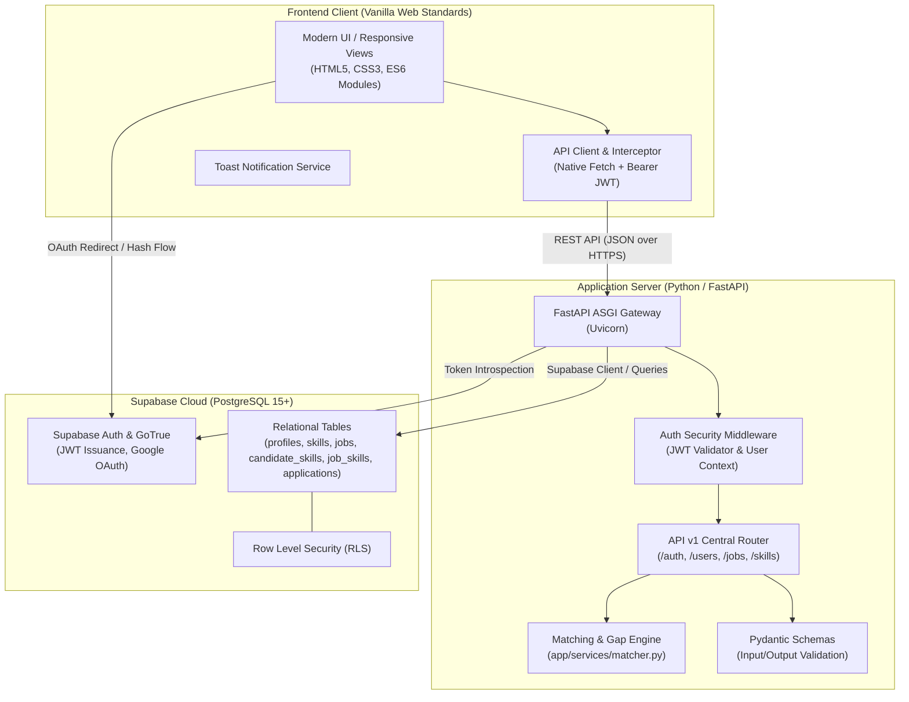
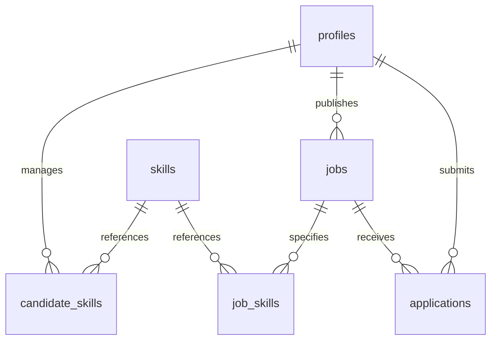

# SkillBridge 🚀

> **The Skill-First Recruitment Platform with Deterministic Match Scoring & Transparent Upskilling Roadmaps**

[](https://www.python.org/)
[](https://fastapi.tiangolo.com/)
[](https://supabase.com/)
[](frontend/)
[](docs/ARCHITECTURE.md)
[](LICENSE)
[](docs/CONTRIBUTING.md)

---

## 📖 Table of Contents

- [Overview & Problem Statement](#-overview--problem-statement)
- [Core Value Proposition](#-core-value-proposition)
- [Key Features](#-key-features)
  - [For Job Seekers / Candidates](#for-job-seekers--candidates)
  - [For Recruiters & Hiring Managers](#for-recruiters--hiring-managers)
  - [Platform & Security Highlights](#platform--security-highlights)
- [Matching Engine & Algorithmic Formulation](#-matching-engine--algorithmic-formulation)
  - [Mathematical Model](#mathematical-model)
  - [Competency Categorization](#competency-categorization)
- [System Architecture](#-system-architecture)
- [Technology Stack Matrix](#-technology-stack-matrix)
- [Project Directory Structure](#-project-directory-structure)
- [Database Schema & Data Model](#-database-schema--data-model)
- [Quick Start & Installation](#-quick-start--installation)
  - [Prerequisites](#prerequisites)
  - [1. Clone Repository](#1-clone-repository)
  - [2. Configure Database (Supabase)](#2-configure-database-supabase)
  - [3. Backend Setup (FastAPI)](#3-backend-setup-fastapi)
  - [4. Seed Sample Data](#4-seed-sample-data)
  - [5. Launch Frontend Client](#5-launch-frontend-client)
- [REST API Reference Overview](#-rest-api-reference-overview)
- [Documentation Hub](#-documentation-hub)
- [Testing](#-testing)
- [Future Roadmap](#-future-roadmap)
- [Contributing](#-contributing)
- [License & Acknowledgments](#-license--acknowledgments)

---

## 🎯 Overview & Problem Statement

### The Problem
Traditional hiring platforms and job boards rely on keyword-heavy resume screening and static Applicant Tracking Systems (ATS). This creates immense friction:
- **For Candidates**: Rejection without transparency. Job seekers never receive objective feedback on *why* their profile was rejected or *which technical competencies* they lacked.
- **For Recruiters**: Resumes are inundated with buzzwords. Hiring managers must manually vet hundreds of unranked applicants without an objective, standardized metric of true skill alignment.

### The Solution: SkillBridge
**SkillBridge** reimagines recruitment as a **competency-first ecosystem**. Candidates are paired with roles through a **deterministic, weighted matching algorithm** that transparently scores compatibility, highlights critical technical gaps, and immediately provides **curated learning roadmaps** to bridge missing skills.

---

## 💎 Core Value Proposition

| Pillar | Description |
| :--- | :--- |
| **Deterministic Match Scoring** | Eliminates guesswork by evaluating required and preferred competencies with explicit weights and proficiency ratings. |
| **Transparent Skill Gap Analysis** | Highlights exact missing qualifications per job and classifies competencies into **Matched**, **Critical Gaps**, and **Bonus Skills**. |
| **Actionable Upskilling Roadmaps** | Directly connects missing job skills to curated video learning paths so candidates can upskill and re-apply. |
| **Pre-Ranked Recruiter Pipelines** | Automatically ranks incoming applicants in real time by compatibility percentage, dramatically cutting time-to-hire. |

---

## ✨ Key Features

### For Job Seekers / Candidates
- **Skill Profile Manager**: Add, update, and manage technical proficiencies across Languages, Frameworks, Databases, and DevOps with verified assessment quiz scores.
- **Personalized Job Recommendations**: Browse open roles automatically sorted and badged with your live match percentage.
- **Dynamic Skill Gap Breakdown**: Drill into any job listing to see visual match progress meters and color-coded competency breakdowns.
- **Interactive Learning Roadmaps**: Instant one-click access from missing skill tags to curated YouTube tutorials and playlists (`roadmap.html`).
- **One-Click Application & Tracking**: Apply with your snapshot match score and monitor status changes (`applied` $\rightarrow$ `reviewing` $\rightarrow$ `shortlisted`).

### For Recruiters & Hiring Managers
- **Fine-Grained Job Builder**: Post roles with title, company, description, and an interactive skill criteria selector.
- **Weighted Competency Tagger**: Mark competencies as **Mandatory (Required)** or **Bonus (Preferred)**, each with adjustable weights ($0.50$ to $2.00$).
- **Applicant Pipeline Dashboard**: Review candidates ordered descending by algorithmic match score.
- **Candidate Vetting & Status Progression**: Inspect candidate profiles, headlines, and resumes, and update applicant statuses with instant visual feedback.

### Platform & Security Highlights
- **FastAPI Core**: Asynchronous Python backend delivering sub-millisecond execution times and auto-generated Swagger documentation.
- **Supabase Authentication & Google OAuth**: Seamless login via email/password or Google Single Sign-On (SSO).
- **PostgreSQL Row Level Security (RLS)**: Enforces access control at the database layer.
- **Zero-Build Lightweight Frontend**: Built with pure HTML5, CSS3, and ES6+ JavaScript—blazing fast, accessible, and responsive.

---

## 🧮 Matching Engine & Algorithmic Formulation

SkillBridge utilizes a **weighted dual-tier matching engine** (`backend/app/services/matcher.py`) that separates mandatory requirements from bonus competencies:

### Mathematical Model

$$\text{Match Score (\%)} = \left[ \left( W_{\text{req}} \times \frac{\sum (w_i \times m_i)}{\sum w_i} \right) + \left( W_{\text{pref}} \times \frac{\sum (w_j \times m_j)}{\sum w_j} \right) \right] \times 100$$

#### Parameter Definitions:
- $W_{\text{req}}$: Importance weight of required skills (**Default: 0.75** / 75%).
- $W_{\text{pref}}$: Importance weight of preferred skills (**Default: 0.25** / 25%).
  - *Dynamic Adaptation*: If a job has no preferred skills, $W_{\text{req}}$ automatically adjusts to **1.00** (100%).
- $w_i, w_j$: Recruiter-defined weight for skill $i$ or $j$ (range $0.5$ to $2.0$).
- $m_i, m_j$: Candidate proficiency multiplier:
  - **Assessment Quiz Score**: $m = \frac{\text{quiz\_score}}{100.0}$ *(Takes highest precedence)*
  - **Proficiency Fallback**: Beginner ($0.25$), Intermediate ($0.50$), Advanced ($0.75$), Expert ($1.00$).

### Competency Categorization

For every candidate-job evaluation, skills are categorized into three distinct visual tiers:

```
┌────────────────────────────────────────────────────────────────────────┐
│                      Skill Compatibility Breakdown                     │
├─────────────────────┬──────────────────────────┬───────────────────────┤
│    Matched Skills   │   Critical Skill Gaps    │  Bonus Competencies   │
│     🟢 Emerald      │       🔴 Crimson         │        🔵 Indigo      │
├─────────────────────┼──────────────────────────┼───────────────────────┤
│ Required skills the │ Mandatory skills missing │ Preferred skills the  │
│ candidate possesses │ from candidate profile;  │ candidate possesses;  │
│ with verified score │ links to learning paths  │ provides score boost  │
└─────────────────────┴──────────────────────────┴───────────────────────┘
```

---

## 🏗️ System Architecture



---

## 💻 Technology Stack Matrix

| Layer | Technology | Key Capabilities & Justification |
| :--- | :--- | :--- |
| **Frontend UI** | HTML5, CSS3, ES6+ JavaScript | Zero build tool complexity, modular architecture, instant load times, native Fetch API integration. |
| **Backend API** | Python 3.10+, FastAPI, Uvicorn | High asynchronous throughput, automatic OpenAPI documentation, strict Pydantic v2 data validation. |
| **Database** | PostgreSQL 15 (Supabase) | ACID compliance, relational integrity with cascading deletes, high performance indexing, pgvector readiness. |
| **Authentication** | Supabase Auth (GoTrue) | Built-in JWT lifecycle, password hashing, and Google OAuth 2.0 social sign-on. |
| **Security** | PostgreSQL Row Level Security | Database-tier authorization guaranteeing multi-tenant security isolation. |
| **Testing** | Pytest | Automated test coverage for matching mathematics, boundary conditions, and edge cases. |

---

## 📂 Project Directory Structure

```text
skillbridge/
├── backend/
│   ├── app/
│   │   ├── api/
│   │   │   └── v1/
│   │   │       ├── endpoints/
│   │   │       │   ├── auth.py          # Signup, login, Google OAuth endpoint
│   │   │       │   ├── jobs.py          # Job posting CRUD, feed, gap analysis, applications
│   │   │       │   ├── skills.py        # Skills taxonomy lookup and search
│   │   │       │   └── users.py         # Candidate & recruiter profile, skill tagging
│   │   │       └── router.py            # API v1 centralized router
│   │   ├── core/
│   │   │   ├── config.py                # Environment settings & pydantic configuration
│   │   │   ├── database.py              # Supabase / PostgreSQL client setup
│   │   │   └── security.py              # JWT authentication dependency
│   │   ├── models/                      # Pydantic data validation schemas
│   │   │   ├── job.py                   # JobCreate, Job, JobSkill schemas
│   │   │   ├── match.py                 # GapAnalysisResult, SkillMatchDetail
│   │   │   └── user.py                  # Profile, Skill, CandidateSkill schemas
│   │   ├── services/
│   │   │   └── matcher.py               # Deterministic dual-tier matching engine
│   │   └── main.py                      # FastAPI bootstrap & CORS middleware
│   ├── tests/
│   │   └── test_matcher.py              # Pytest unit tests for matching algorithm
│   ├── .env.example                     # Environment template
│   ├── requirements.txt                 # Backend Python dependencies
│   └── seed_db.py                       # Automated database seeder (skills & sample jobs)
│
├── frontend/
│   ├── assets/
│   │   ├── css/
│   │   │   ├── main.css                 # Global tokens, typography, CSS variables
│   │   │   ├── components.css           # Buttons, form controls, badges, cards, toasts
│   │   │   ├── dashboard.css            # Candidate & recruiter dashboard styles
│   │   │   └── auth.css                 # Login and registration view styling
│   │   └── js/
│   │       ├── api.js                   # Unified fetch client with JWT interceptor & Toasts
│   │       ├── auth.js                  # Authentication state manager & route guards
│   │       ├── candidate.js             # Candidate dashboard & skill manager controller
│   │       ├── recruiter.js             # Job post builder & applicant pipeline controller
│   │       └── matching.js              # Match score meters & gap visualization
│   ├── index.html                       # Public landing page & platform showcase
│   ├── login.html                       # Unified email & Google OAuth login
│   ├── register.html                    # Role-based onboarding page
│   ├── auth-callback.html               # OAuth callback token processor
│   ├── candidate-dashboard.html         # Candidate job feed, skills manager, application tracker
│   ├── recruiter-dashboard.html         # Recruiter posted jobs & ranked applicant pipeline
│   ├── post-job.html                    # Job posting creator with skill requirement tagger
│   ├── job-detail.html                  # Deep-dive job view with live skill gap breakdown
│   └── roadmap.html                     # Curated video learning playlist for missing skills
│
├── docs/
│   ├── API_DOCUMENTATION.md             # Complete REST API specification
│   ├── ARCHITECTURE.md                  # In-depth system design & sequence diagrams
│   ├── DATABASE_SCHEMA.md               # Data dictionary & ER diagram
│   ├── SETUP_GUIDE.md                   # Step-by-step local setup & deployment guide
│   ├── CONTRIBUTING.md                  # Contribution rules & branching conventions
│   └── schema.sql                       # PostgreSQL DDL schema with RLS policies
│
└── README.md                            # Repository landing documentation
```

---

## 🗄️ Database Schema & Data Model

The platform runs on 6 core relational tables in Supabase PostgreSQL:



1. **`profiles`**: User profiles linked to Supabase Auth (`id`, `email`, `full_name`, `role`, `bio`, `headline`, `location`, `resume_url`).
2. **`skills`**: Standardized competency taxonomy (`id`, `name`, `category`).
3. **`candidate_skills`**: Candidate skill proficiencies and quiz scores (`candidate_id`, `skill_id`, `proficiency_level`, `years_experience`, `quiz_score`).
4. **`jobs`**: Recruiter job listings (`id`, `recruiter_id`, `title`, `company_name`, `description`, `location`, `employment_type`, `is_active`).
5. **`job_skills`**: Job skill requirements with weights (`job_id`, `skill_id`, `is_required`, `weight`).
6. **`applications`**: Application records with frozen compatibility score (`id`, `job_id`, `candidate_id`, `match_score`, `status`).

*For full column definitions, constraints, and RLS policies, see [`docs/DATABASE_SCHEMA.md`](docs/DATABASE_SCHEMA.md).*

---

## ⚡ Quick Start & Installation

### Prerequisites
- **Python 3.10+**
- **Git**
- A free **[Supabase](https://supabase.com)** account

### 1. Clone Repository
```bash
git clone https://github.com/RushalBangar/Curiousparc_Trinity-Coders.git skillbridge
cd skillbridge
```

### 2. Configure Database (Supabase)
1. In your Supabase Dashboard, create a new project.
2. Go to **SQL Editor**, paste the contents of [`docs/schema.sql`](docs/schema.sql), and click **Run**.
3. Under **Project Settings $\rightarrow$ API**, copy your **Project URL**, **anon key**, and **JWT secret**.

### 3. Backend Setup (FastAPI)
```bash
cd backend

# Create and activate virtual environment
python -m venv venv

# Windows PowerShell:
.\venv\Scripts\Activate.ps1
# macOS/Linux:
source venv/bin/activate

# Install dependencies
pip install -r requirements.txt

# Configure environment
cp .env.example .env
# Edit backend/.env and populate SUPABASE_URL, SUPABASE_KEY, JWT_SECRET

# Start FastAPI server
uvicorn app.main:app --reload --port 8000
```
API will be live at `http://localhost:8000` (Interactive docs at `http://localhost:8000/docs`).

### 4. Seed Sample Data
In a separate terminal (with virtual environment active):
```bash
python backend/seed_db.py
```

### 5. Launch Frontend Client
From the repository root directory:
```bash
python -m http.server 5500 --directory frontend
```
Navigate to **`http://localhost:5500`** in your browser to explore SkillBridge!

---

## 📡 REST API Reference Overview

| Method | Endpoint | Description | Auth Required |
| :--- | :--- | :--- | :--- |
| `POST` | `/api/v1/auth/signup` | Register a new user profile | Public |
| `POST` | `/api/v1/auth/login` | Authenticate with credentials and receive JWT | Public |
| `GET` | `/api/v1/auth/google` | Get Google OAuth 2.0 authorization URL | Public |
| `GET` | `/api/v1/users/me` | Fetch authenticated user profile | Authenticated |
| `POST` | `/api/v1/users/me/init-profile` | Initialize profile after third-party OAuth | Authenticated |
| `GET` | `/api/v1/users/me/skills` | Fetch candidate's competencies and quiz scores | Seeker |
| `POST` | `/api/v1/users/me/skills` | Add or update a candidate skill | Seeker |
| `DELETE` | `/api/v1/users/me/skills/{id}` | Remove a candidate skill | Seeker |
| `GET` | `/api/v1/users/me/applications` | List candidate's submitted job applications | Seeker |
| `GET` | `/api/v1/skills` | Search skill taxonomy by name or category | Authenticated |
| `POST` | `/api/v1/jobs` | Create a new job with weighted skill criteria | Recruiter |
| `GET` | `/api/v1/jobs/feed` | Paginated feed of active job listings | Authenticated |
| `GET` | `/api/v1/jobs/{job_id}` | Detailed job view + live Gap Analysis payload | Authenticated |
| `POST` | `/api/v1/jobs/{job_id}/apply` | Apply to a job and snapshot match score | Seeker |
| `GET` | `/api/v1/jobs/{job_id}/candidates` | View ranked candidate pipeline for job | Recruiter (Owner) |
| `PATCH` | `/api/v1/jobs/{job_id}/applications/{candidate_id}` | Update applicant status (shortlist/reject) | Recruiter (Owner) |

*For complete request/response schemas and curl examples, see [`docs/API_DOCUMENTATION.md`](docs/API_DOCUMENTATION.md).*

---

## 📚 Documentation Hub

Explore our detailed project documentation:

- 📘 [**REST API Documentation**](docs/API_DOCUMENTATION.md): Complete endpoint schemas, query parameters, and error responses.
- 📐 [**System Architecture & Algorithms**](docs/ARCHITECTURE.md): Deep dive into system sequence diagrams, matching mathematics, and security.
- 🗄️ [**Database Schema & Data Dictionary**](docs/DATABASE_SCHEMA.md): Complete table specifications, foreign keys, and RLS policies.
- 🛠️ [**Setup & Deployment Guide**](docs/SETUP_GUIDE.md): Local development walkthrough and cloud deployment to Render & Vercel.
- 🤝 [**Contributing Guidelines**](docs/CONTRIBUTING.md): Git branch conventions, commit standards, and pull request procedures.
- 📄 [**SQL Schema DDL**](docs/schema.sql): Raw PostgreSQL DDL script for database initialization.

---

## 🧪 Testing

The platform's matching calculations are thoroughly verified with unit tests:

```bash
# Run pytest test suite
pytest backend/tests/test_matcher.py -v
```

The test suite validates:
- Full match with mandatory and preferred competencies (100% score)
- Partial matches with proportional score decay
- Zero-match and empty profile handling
- Job listings without preferred skills (dynamic 1.00 weight fallback)
- Quiz assessment multipliers vs self-reported tier weighting

---

## 🗺️ Future Roadmap

- [ ] **AI-Powered Semantic Resume Parsing**: Automatically extract verified skills and experience directly from uploaded PDF resumes.
- [ ] **Vector Embeddings with pgvector**: Semantic similarity search between unstructured job descriptions and candidate portfolios.
- [ ] **In-Platform Interactive Skill Assessments**: Adaptive technical quizzes to verify candidate proficiencies directly within SkillBridge.
- [ ] **Automated Interview Scheduling**: Calendar integration for shortlisted candidates to book interviews directly with recruiters.
- [ ] **Recruiter Analytics Dashboard**: Deep analytics on skill shortages, applicant demographics, and hiring velocity.

---

## 🤝 Contributing

Contributions, feedback, and feature proposals are welcome! Please read our [Contributing Guidelines](docs/CONTRIBUTING.md) to get started.

1. Fork the Project
2. Create your Feature Branch (`git checkout -b feature/AmazingFeature`)
3. Commit your Changes (`git commit -m 'feat(engine): add dynamic multiplier support'`)
4. Push to the Branch (`git push origin feature/AmazingFeature`)
5. Open a Pull Request

---

## 📄 License & Acknowledgments

Distributed under the **MIT License**. See `LICENSE` for more information.

Developed with passion by **Trinity Coders / Curiousparc**:
- Built with [FastAPI](https://fastapi.tiangolo.com/), [Supabase](https://supabase.com/), and modern web standards.
