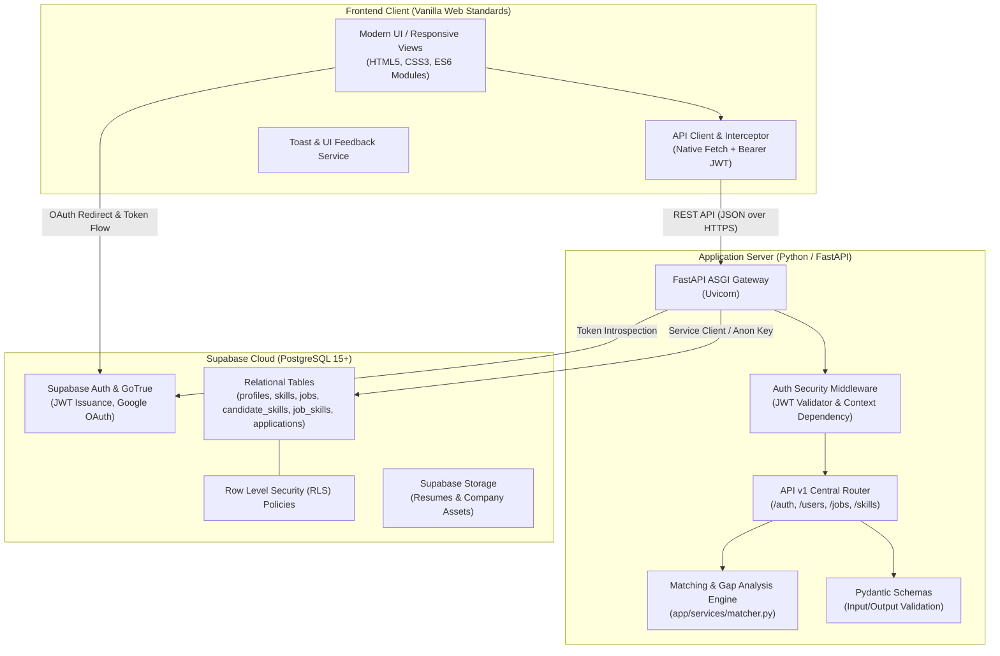
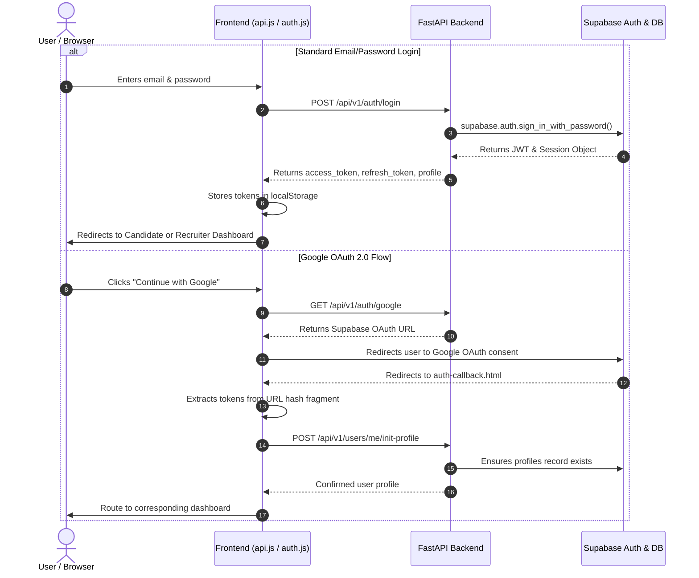
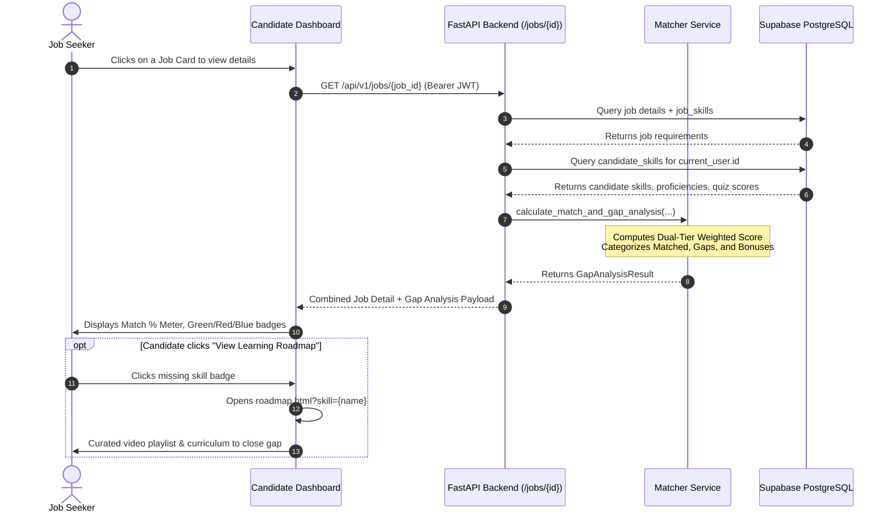
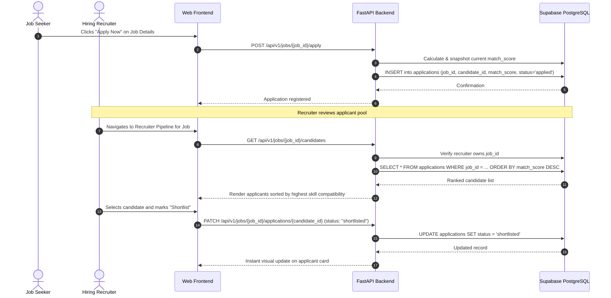

# SkillBridge — Technical Architecture & System Design

SkillBridge is built on a decoupled, service-oriented architecture prioritizing low latency, data integrity, mathematical determinism, and seamless user experience.

---

## Table of Contents

- [System Architecture Overview](#system-architecture-overview)
- [Core Components](#core-components)
  - [1. Frontend Presentation Layer](#1-frontend-presentation-layer)
  - [2. Application & API Layer (FastAPI)](#2-application--api-layer-fastapi)
  - [3. Persistence & Auth Layer (Supabase / PostgreSQL)](#3-persistence--auth-layer-supabase--postgresql)
- [Algorithmic Formulation: Skill-to-Job Matching Engine](#algorithmic-formulation-skill-to-job-matching-engine)
  - [Mathematical Model](#mathematical-model)
  - [Competency Categorization](#competency-categorization)
  - [Proficiency & Assessment Multipliers](#proficiency--assessment-multipliers)
- [Sequence Workflows](#sequence-workflows)
  - [Authentication & Session Lifecycle](#authentication--session-lifecycle)
  - [Skill Matching & Gap Analysis Workflow](#skill-matching--gap-analysis-workflow)
  - [Application & Recruiter Pipeline Management](#application--recruiter-pipeline-management)
- [Security, Authorization & RLS Model](#security-authorization--rls-model)

---

## System Architecture Overview



---

## Core Components

### 1. Frontend Presentation Layer
- **Technology**: Vanilla HTML5, Modern CSS3 with custom properties (CSS variables), and Modular Vanilla JavaScript (ES6+).
- **Design Philosophy**: Zero bundler complexity, blazing-fast asset delivery, no framework overhead.
- **Key Modules**:
  - `api.js`: Centralized singleton `ApiClient` wrapping the browser's `fetch()` API. It automatically attaches Bearer tokens, handles global error interception, triggers 401 automatic session cleanup, and integrates non-blocking Toast alerts.
  - `auth.js`: Manages user authentication lifecycle, local storage persistence, and role-based route guarding.
  - `candidate.js`: Powers the seeker dashboard, skill tagging system, proficiency sliders, and application history.
  - `recruiter.js`: Manages job publication forms, multi-skill taggers with requirement toggles and weight sliders, and applicant ranking pipelines.
  - `matching.js`: Visualizes match score meters, progress rings, and color-coded skill gap badges.

### 2. Application & API Layer (FastAPI)
- **Framework**: Python 3.10+ / FastAPI, running on Uvicorn ASGI server.
- **Key Capabilities**:
  - **Asynchronous Execution**: Native `async`/`await` patterns for high-throughput I/O operations.
  - **Type Safety & Data Validation**: Pydantic v2 data models guarantee strict schema enforcement for all ingress payloads and egress responses.
  - **Dependency Injection**: Reusable FastAPI dependencies (`get_current_user`, `get_supabase_client`) provide stateless authentication verification and database client distribution.
  - **Automated Documentation**: OpenAPI 3.0 specs available dynamically at `/docs` (Swagger UI) and `/redoc`.

### 3. Persistence & Auth Layer (Supabase / PostgreSQL)
- **Database Engine**: Hosted PostgreSQL 15 via Supabase.
- **Relational Integrity**: Enforced through foreign key constraints (`ON DELETE CASCADE`) across user profiles, job postings, skills taxonomy, and applications.
- **Authentication**: Supabase Auth (GoTrue) handles password hashing, JWT signing, refresh token rotation, and Google OAuth 2.0 social authentication.
- **Row Level Security**: Database-level authorization rules prevent unauthorized reads or writes at the SQL query execution layer.

---

## Algorithmic Formulation: Skill-to-Job Matching Engine

The core differentiator of SkillBridge is its **deterministic, weighted dual-tier matching engine** (`app/services/matcher.py`). Rather than opaque heuristic keyword scraping, it applies structured mathematical scoring.

### Mathematical Model

The match percentage is calculated by evaluating mandatory (required) job competencies separately from optional (preferred) competencies:

$$\text{Match Score (\%)} = \left[ \left( W_{\text{req}} \times \frac{\sum (w_i \times m_i)}{\sum w_i} \right) + \left( W_{\text{pref}} \times \frac{\sum (w_j \times m_j)}{\sum w_j} \right) \right] \times 100$$

#### Variables & Parameters:
- $W_{\text{req}}$: Weight factor for required skills (**Default: 0.75** or 75% of the total score).
- $W_{\text{pref}}$: Weight factor for preferred skills (**Default: 0.25** or 25% of the total score).
- **Edge Case handling**: If a job listing specifies no preferred skills, $W_{\text{req}}$ automatically adapts to **1.00** (100%), preventing dilution of score.
- $w_i, w_j$: The recruiter-defined importance multiplier for skill $i$ or $j$ (range $0.5$ to $2.0$, default $1.0$).
- $m_i, m_j$: The candidate's proficiency or assessment multiplier for skill $i$ or $j$ (range $0.0$ to $1.0$).

### Proficiency & Assessment Multipliers ($m$)

SkillBridge evaluates proficiency through two vectors:

1. **Assessment Quiz Score (Highest Precedence)**:
   If the candidate has verified their competency via a skill assessment quiz:
   $$m = \frac{\text{quiz\_score}}{100.0}$$
   *(Example: A quiz score of 85 yields $m = 0.85$)*

2. **Self-Reported Proficiency Tier (Fallback)**:
   When no quiz score exists, the system maps the self-declared level:
   - **Beginner**: $0.25$
   - **Intermediate**: $0.50$
   - **Advanced**: $0.75$
   - **Expert**: $1.00$

### Competency Categorization

For every candidate-job pairing, the engine categorizes competencies into three clear buckets:

```
┌────────────────────────────────────────────────────────────────────────┐
│                        Candidate Skills vs Job Req                     │
├─────────────────────┬──────────────────────────┬───────────────────────┤
│    Matched Skills   │   Critical Skill Gaps    │  Bonus Competencies   │
│       (Green)       │          (Red)           │        (Blue)         │
├─────────────────────┼──────────────────────────┼───────────────────────┤
│ Required skills the │ Required skills missing  │ Preferred skills the  │
│ candidate possesses │ from candidate profile.  │ candidate possesses.  │
│ (Contributes to     │ Directly linked to the   │ Boosts overall score  │
│ required score)     │ interactive Roadmaps.    │ beyond baseline.      │
└─────────────────────┴──────────────────────────┴───────────────────────┘
```

---

## Sequence Workflows

### Authentication & Session Lifecycle



---

### Skill Matching & Gap Analysis Workflow



---

### Application & Recruiter Pipeline Management



---

## Security, Authorization & RLS Model

1. **Stateless JWT Authentication**:
   - The FastAPI backend validates bearer tokens against Supabase's signing secret on every protected request.
   - User identity and permissions are injected into route handlers using FastAPI's dependency system (`Depends(get_current_user)`).

2. **Role-Based Access Control (RBAC)**:
   - System profiles enforce strict roles (`seeker`, `recruiter`, `admin`).
   - Route-level role guards prevent privilege escalation (e.g. seekers attempting to execute `POST /jobs` or recruiters viewing seeker-only skill endpoints).

3. **Row Level Security (RLS)**:
   - All tables (`profiles`, `skills`, `candidate_skills`, `jobs`, `job_skills`, `applications`) have PostgreSQL Row Level Security enabled.
   - Even in direct client integrations, users cannot access records outside their permission envelope.
