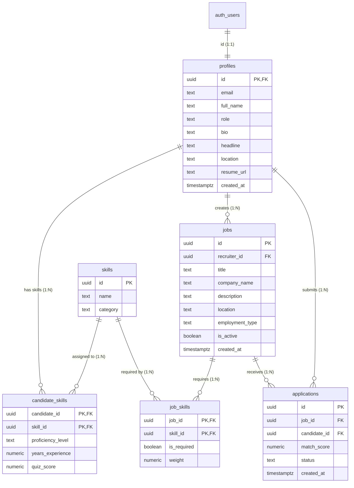

# SkillBridge — Database Schema & Data Dictionary

SkillBridge utilizes **PostgreSQL** hosted on **Supabase**, leveraging relational foreign-key integrity, ACID transactions, check constraints, and Row Level Security (RLS).

---

## Table of Contents

- [Entity-Relationship Diagram](#entity-relationship-diagram)
- [Table Specifications](#table-specifications)
  - [1. profiles](#1-profiles)
  - [2. skills](#2-skills)
  - [3. candidate_skills](#3-candidate_skills)
  - [4. jobs](#4-jobs)
  - [5. job_skills](#5-job_skills)
  - [6. applications](#6-applications)
- [Row Level Security (RLS) Policies](#row-level-security-rls-policies)
- [Database Seeding Reference](#database-seeding-reference)
- [SQL Schema DDL](#sql-schema-ddl)

---

## Entity-Relationship Diagram



---

## Table Specifications

### 1. `profiles`
Stores user profile information linked directly to Supabase Auth's `auth.users` table.

| Column | Type | Constraints | Default | Description |
| :--- | :--- | :--- | :--- | :--- |
| `id` | `UUID` | `PRIMARY KEY`, `REFERENCES auth.users(id) ON DELETE CASCADE` | — | Unique user identifier synced with Supabase Auth |
| `email` | `TEXT` | `NOT NULL`, `UNIQUE` | — | User's primary contact and login email |
| `full_name` | `TEXT` | `NOT NULL` | — | User's full display name |
| `role` | `TEXT` | `NOT NULL`, `CHECK (role IN ('seeker', 'recruiter', 'admin'))` | `'seeker'` | System role determining access rights |
| `bio` | `TEXT` | `NULLABLE` | `NULL` | Brief biography / summary of background |
| `headline` | `TEXT` | `NULLABLE` | `NULL` | Professional headline (e.g. "Lead Backend Architect") |
| `location` | `TEXT` | `NULLABLE` | `NULL` | City, State, or Country (e.g. "San Francisco, CA") |
| `resume_url` | `TEXT` | `NULLABLE` | `NULL` | Direct cloud link to uploaded resume document |
| `created_at` | `TIMESTAMPTZ` | `NOT NULL` | `NOW()` | Timestamp of record creation |

---

### 2. `skills`
Centralized, standardized catalog of technical skills and domains.

| Column | Type | Constraints | Default | Description |
| :--- | :--- | :--- | :--- | :--- |
| `id` | `UUID` | `PRIMARY KEY` | `gen_random_uuid()` | Unique skill identifier |
| `name` | `TEXT` | `NOT NULL`, `UNIQUE` | — | Skill name (e.g. "Python", "FastAPI", "Docker") |
| `category` | `TEXT` | `NOT NULL` | — | Category (e.g. "Languages", "Frameworks", "Databases", "DevOps") |

---

### 3. `candidate_skills`
Associates candidate profiles with specific technical competencies, proficiency levels, and assessment scores.

| Column | Type | Constraints | Default | Description |
| :--- | :--- | :--- | :--- | :--- |
| `candidate_id` | `UUID` | `REFERENCES profiles(id) ON DELETE CASCADE` | — | Candidate profile UUID (composite primary key part 1) |
| `skill_id` | `UUID` | `REFERENCES skills(id) ON DELETE CASCADE` | — | Skill catalog UUID (composite primary key part 2) |
| `proficiency_level`| `TEXT` | `NOT NULL`, `CHECK (proficiency_level IN ('beginner', 'intermediate', 'advanced', 'expert'))` | — | Self-declared skill proficiency tier |
| `years_experience` | `NUMERIC(3, 1)` | `NULLABLE` | `NULL` | Years of practical experience (e.g. `3.5`) |
| `quiz_score` | `NUMERIC(5, 2)` | `NULLABLE` | `NULL` | Assessment quiz score percentage (e.g. `85.00`) |

*Primary Key*: `(candidate_id, skill_id)`

---

### 4. `jobs`
Employer job listings posted by recruiters.

| Column | Type | Constraints | Default | Description |
| :--- | :--- | :--- | :--- | :--- |
| `id` | `UUID` | `PRIMARY KEY` | `gen_random_uuid()` | Unique job posting identifier |
| `recruiter_id` | `UUID` | `REFERENCES profiles(id) ON DELETE CASCADE` | — | Recruiter profile UUID who created the listing |
| `title` | `TEXT` | `NOT NULL` | — | Job title (e.g. "Senior Full Stack Engineer") |
| `company_name` | `TEXT` | `NOT NULL` | — | Name of hiring company or client |
| `description` | `TEXT` | `NOT NULL` | — | Full job description and requirements overview |
| `location` | `TEXT` | `NOT NULL` | — | Location (e.g. "Remote - US", "New York, NY") |
| `employment_type`| `TEXT` | `NOT NULL`, `CHECK (employment_type IN ('full-time', 'part-time', 'internship', 'contract'))` | — | Employment classification |
| `is_active` | `BOOLEAN` | `NOT NULL` | `true` | Visibility toggle for public job feed |
| `created_at` | `TIMESTAMPTZ` | `NOT NULL` | `NOW()` | Timestamp when listing was published |

---

### 5. `job_skills`
Defines the required and preferred skill criteria for each individual job posting, along with relative importance weights.

| Column | Type | Constraints | Default | Description |
| :--- | :--- | :--- | :--- | :--- |
| `job_id` | `UUID` | `REFERENCES jobs(id) ON DELETE CASCADE` | — | Job posting UUID (composite primary key part 1) |
| `skill_id` | `UUID` | `REFERENCES skills(id) ON DELETE CASCADE` | — | Skill catalog UUID (composite primary key part 2) |
| `is_required` | `BOOLEAN` | `NOT NULL` | `true` | `true` = Mandatory prerequisite; `false` = Preferred/Bonus |
| `weight` | `NUMERIC(3, 2)` | `NOT NULL` | `1.00` | Relative importance factor (typically `0.50` to `2.00`) |

*Primary Key*: `(job_id, skill_id)`

---

### 6. `applications`
Stores candidate job applications along with the frozen mathematical match score snapshot calculated at application time.

| Column | Type | Constraints | Default | Description |
| :--- | :--- | :--- | :--- | :--- |
| `id` | `UUID` | `PRIMARY KEY` | `gen_random_uuid()` | Unique application record identifier |
| `job_id` | `UUID` | `REFERENCES jobs(id) ON DELETE CASCADE` | — | Target job listing UUID |
| `candidate_id` | `UUID` | `REFERENCES profiles(id) ON DELETE CASCADE` | — | Applicant candidate profile UUID |
| `match_score` | `NUMERIC(5, 2)` | `NULLABLE` | `NULL` | Frozen match compatibility percentage (0.00 to 100.00) |
| `status` | `TEXT` | `NOT NULL`, `CHECK (status IN ('applied', 'reviewing', 'shortlisted', 'rejected'))` | `'applied'` | Recruiter pipeline stage |
| `created_at` | `TIMESTAMPTZ` | `NOT NULL` | `NOW()` | Submission timestamp |

*Unique Constraint*: `UNIQUE (job_id, candidate_id)` prevents duplicate applications by the same candidate for a given job.

---

## Row Level Security (RLS) Policies

Row Level Security is enabled across all platform tables in Supabase:

```sql
ALTER TABLE profiles ENABLE ROW LEVEL SECURITY;
ALTER TABLE skills ENABLE ROW LEVEL SECURITY;
ALTER TABLE candidate_skills ENABLE ROW LEVEL SECURITY;
ALTER TABLE jobs ENABLE ROW LEVEL SECURITY;
ALTER TABLE job_skills ENABLE ROW LEVEL SECURITY;
ALTER TABLE applications ENABLE ROW LEVEL SECURITY;
```

### Access Policies Summary:
- **`profiles`**: Public read for basic recruiter/candidate info; update allowed only when `auth.uid() = id`.
- **`skills`**: Public read for all authenticated users; insert/update restricted to admin roles.
- **`candidate_skills`**: Candidates can insert, select, update, and delete only their own records (`candidate_id = auth.uid()`).
- **`jobs`**: Anyone authenticated can read active jobs (`is_active = true`); only recruiters can insert or update their own listings.
- **`applications`**: Candidates can view their own applications; recruiters can view all applications submitted to jobs where `recruiter_id = auth.uid()`.

---

## Database Seeding Reference

The repository provides an automated seeding script in `backend/seed_db.py`:
- Populates core technical competencies across **Languages**, **Frameworks**, **Databases**, and **DevOps** (e.g. Python, JavaScript, TypeScript, Go, Java, React, Vue.js, FastAPI, Node.js, Django, PostgreSQL, MongoDB, Redis, Docker, Kubernetes, AWS, CI/CD).
- Generates sample active job listings associated with a verified recruiter account.

To execute the seed script:
```bash
python backend/seed_db.py
```

---

## SQL Schema DDL

The canonical SQL schema file is maintained at [`docs/schema.sql`](file:///d:/Web/SkillBridge/docs/schema.sql).
